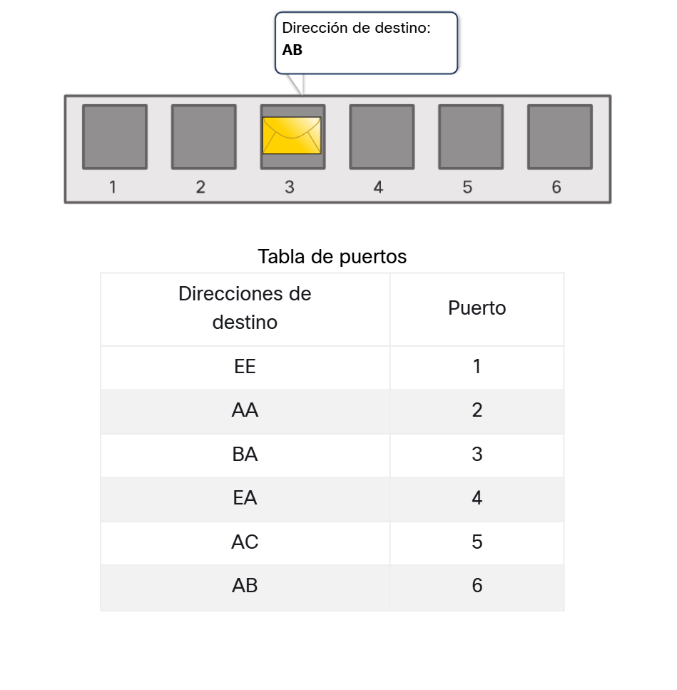
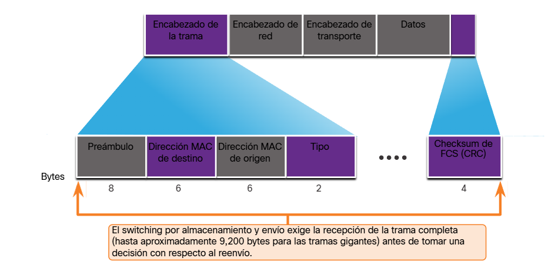
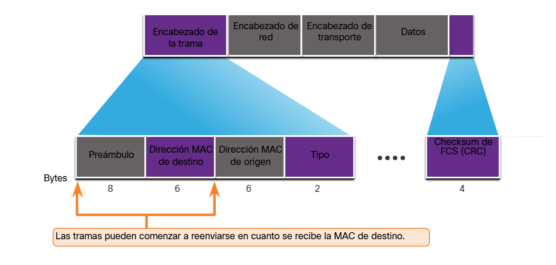
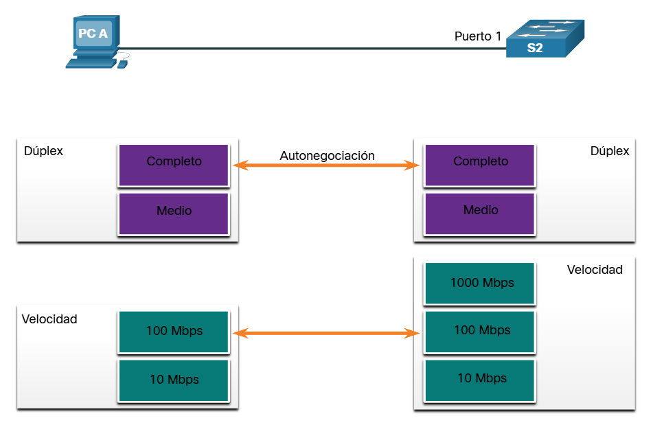
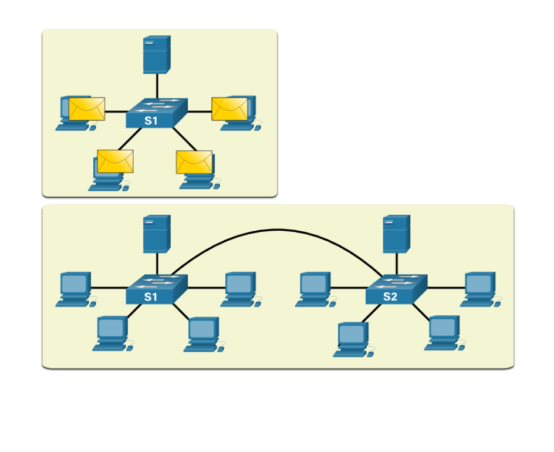

# Módulo 2: Conceptos de switching

---

## Contenido

- **Reenvío de tramas:** Explica la forma en el que las tramas se reenvían en una red conmutada.

- **Dominios de switching:** Compara un dominio de colisión con un dominio de difusión.

---

## Reenvío de tramas

El switching y reenvío de tramas es un concepto básico en las redes. Un switch decide por dónde enviar una trama según su flujo de tráfico, considerando el **puerto de entrada** (por donde llega la trama) y el puerto de salida (por donde se reenvía).

En una red LAN, el switch utiliza una tabla de switching que asocia direcciones MAC con puertos físicos. Su “inteligencia” consiste en consultar esta tabla para reenviar cada trama Ethernet usando la dirección MAC de destino, sin importar por qué puerto haya ingresado.

Así, una trama destinada a una MAC específica siempre saldrá por el mismo puerto, y nunca se reenviará por el mismo puerto por el que entró. Este mecanismo garantiza un reenvío eficiente y ordenado del tráfico dentro de la red.

---

### Tabla de direcciones MAC del switch

Un switch combina hardware y software para dirigir el tráfico de red usando la dirección MAC de destino. Para reenviar una trama correctamente, primero debe aprender qué dispositivos están conectados a cada puerto.

Este aprendizaje se realiza registrando las direcciones MAC de origen de las tramas que recibe y almacenándolas en la tabla de direcciones MAC, también llamada tabla CAM, la cual se guarda en una memoria especial de alta velocidad (CAM).

Gracias a esta tabla, el switch puede identificar el puerto correcto por el cual enviar cada trama y reenviarla de forma eficiente hacia el dispositivo de destino.

---

### El método Aprender y Reenviar del Switch

Cuando una trama Ethernet ingresa a un switch, se siguen dos pasos básicos:

**1. Aprender (MAC de origen):**  

El switch revisa la dirección MAC de origen y el puerto de entrada.

- Si la MAC no está en la tabla, la agrega junto con el puerto.

- Si ya existe, actualiza su temporizador.

- Si la MAC aparece por otro puerto, se reemplaza la entrada con el nuevo puerto.

**2. Reenviar (MAC de destino):** 

El switch analiza la dirección MAC de destino.

- Si la MAC está en la tabla, envía la trama por el puerto correspondiente.

- Si no está, la envía por todos los puertos excepto el de entrada (unidifusión desconocida).

- Si es una dirección de difusión o multidifusión, también la reenvía por todos los puertos excepto el de entrada.

---

### Métodos de reenvío del switch

Los switches de capa 2 toman decisiones de reenvío muy rápido gracias al uso de ASIC, que optimizan el procesamiento de paquetes y permiten manejar muchos puertos sin afectar el rendimiento.

Existen dos métodos de switching:

- **Almacenamiento y reenvío**: el switch recibe la trama completa, verifica errores mediante CRC y luego decide reenviarla. Es el método más usado en switches LAN Cisco.

- **Corte (cut-through)**: el switch comienza a reenviar la trama tan pronto identifica la dirección MAC de destino, sin esperar a recibirla completa.

---

### Intercambio de almacenamiento y reenvío

El método de almacenamiento y reenvío se diferencia del método de corte por dos características principales:

- **Verificación de errores**: el switch recibe la trama completa y verifica su integridad usando el FCS. Si la trama tiene errores, se descarta; si no, se reenvía.

- **Almacenamiento en búfer**: permite manejar diferentes velocidades de puertos. El switch guarda la trama completa, realiza la verificación y luego la envía por el puerto de salida adecuado.

Este método garantiza mayor confiabilidad, ya que solo se reenvían tramas libres de errores.

---

### Switching por método de corte

El switching por almacenamiento y reenvío descarta las tramas que no superan la verificación FCS, evitando reenviar tramas con errores.

En cambio, el método de corte no verifica el FCS, por lo que puede reenviar tramas no válidas, pero ofrece una mayor velocidad, ya que toma la decisión de reenvío apenas identifica la dirección MAC de destino en la tabla MAC.

En el switching por corte, el switch no espera a recibir toda la trama para reenviarla. Una variante es el switching libre de fragmentos, que comienza el reenvío después de leer el campo Tipo, logrando mejor detección de errores sin aumentar casi la latencia.

Gracias a su baja latencia, el método de corte es ideal para aplicaciones de alto rendimiento (HPC) que requieren tiempos de respuesta muy bajos. Sin embargo, como puede reenviar tramas con errores, en redes con alta tasa de fallos puede afectar negativamente el ancho de banda al propagar tramas dañadas.

---

## Dominios de switching

### Dominio de colisiones

Los switches ayudan a eliminar colisiones y reducir la congestión en la red al gestionar mejor el tráfico entre dispositivos. En redes antiguas con hubs, varios equipos compartían el mismo medio, formando dominios de colisión, donde ocurrían colisiones si más de un dispositivo transmitía al mismo tiempo.

En un switch, cada puerto en semidúplex constituye su propio dominio de colisión. Cuando los puertos funcionan en dúplex completo, no existen dominios de colisión. Por defecto, los puertos del switch negocian automáticamente dúplex completo si el dispositivo conectado lo permite; si el otro dispositivo solo soporta semidúplex (como un hub antiguo), el puerto del switch operará en ese modo y habrá dominio de colisión.

Cuando ambos dispositivos lo soportan, se selecciona dúplex completo y el mayor ancho de banda común, optimizando el rendimiento de la red.

---

### Dominios de difusión

Un conjunto de switches interconectados forma un único dominio de difusión de capa 2, llamado dominio de difusión MAC. En este dominio, todos los dispositivos de la LAN reciben las tramas de difusión, que se envían usando una dirección MAC de destino con todos los bits en 1.

Solo los dispositivos de capa 3, como los routers, pueden dividir un dominio de difusión. Al hacerlo, también separan los dominios de colisión, ayudando a reducir el tráfico innecesario y mejorar el rendimiento de la red.

Cuando un switch recibe una trama de difusión, la reenvía por todos sus puertos excepto el de entrada, por lo que todos los dispositivos conectados reciben y procesan una copia.

Aunque las difusiones son necesarias para descubrir dispositivos y servicios, su exceso consume ancho de banda y puede generar congestión, reduciendo el rendimiento de la red.

Al interconectar switches, el dominio de difusión se amplía. Así, una trama de difusión enviada a un switch se propaga al otro y llega a todos los dispositivos conectados a ambos switches, incrementando el impacto del tráfico de difusión.

---

### Alivio de la congestión en la red

Los switches LAN reducen la congestión de red al operar por defecto en dúplex completo, eliminando los dominios de colisión y ofreciendo todo el ancho de banda a cada puerto. Esto mejora notablemente el rendimiento y es obligatorio para Ethernet de 1 Gb/s o superior.

Además, alivian la congestión gracias a estas características:

- **Altas velocidades de puerto** (desde 100 Mbps hasta 100 Gbps según la capa), que disminuyen cuellos de botella.

- **Conmutación interna rápida**, mediante buses o memoria compartida de alto rendimiento.

- **Búferes grandes**, que almacenan tramas temporalmente y evitan pérdidas al pasar de puertos rápidos a más lentos.

- **Alta densidad de puertos**, que reduce costos y mantiene el tráfico local, mejorando la eficiencia de la red.

